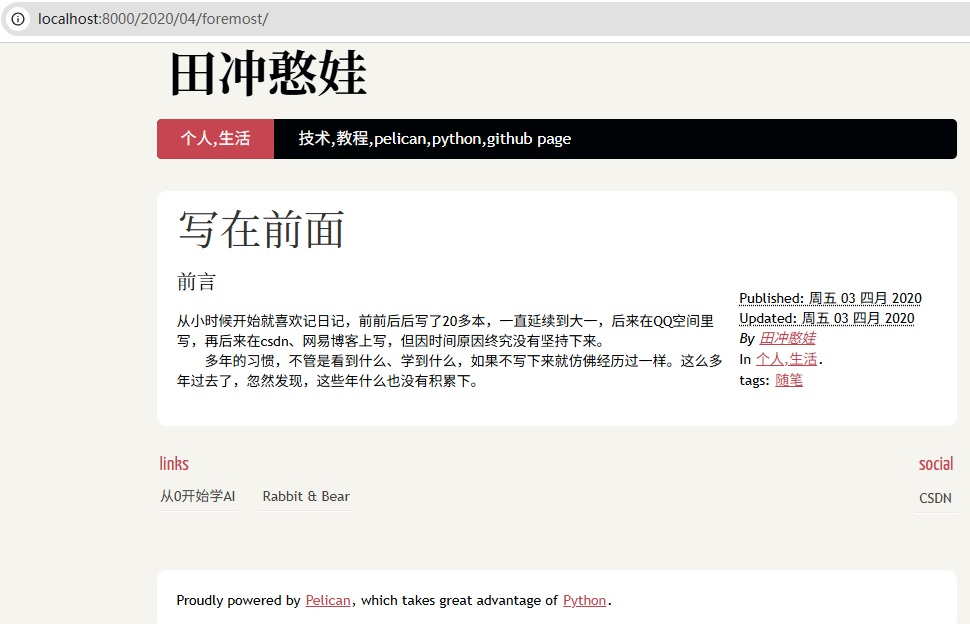

Title: 使用pelican搭建博客的三种图片使用方式
Date: 2025-12-24 14:30
Modified: 2025-12-24 14:30
Category: 技术,教程
Tags: pelican,github.io,图片使用,python
Slug: pelican-image-usage
Author: 田冲憨娃

### 前言
上一篇博客分享了如何用pelican+github.io搭建个人博客，完成基础搭建后，写文章时难免会遇到插入图片的需求——不管是技术教程的步骤截图、生活分享的实拍照片，还是笔记中的示意图，合适的图片能让内容更直观。

这篇文章就来详细拆解三种实用的图片使用方式，从最简单的直接引用到功能丰富的插件使用，再到灵活的github图床方案，每一步都有具体操作，新手也能轻松上手。本篇博客的示例图片，将采用第二种方式（pelican-photos插件）实现，大家可以直观看到最终效果～

## 一、直接使用图片（最简单直接的方案）
这种方式无需额外插件，直接通过markdown的图片语法引用本地图片，适合图片数量少、无需复杂展示效果的场景。

### 操作步骤
1. **创建图片存储目录**
在博客的`content`目录下，新建`images`文件夹（用于存放所有图片）：
```bash
# 进入blog/content目录
cd blog/content
mkdir images
```
将需要使用的图片（比如`local_test.jpg`）复制到`images`文件夹中。

2. **配置pelican识别图片目录**
打开博客根目录下的`pelicanconf.py`文件，添加`STATIC_PATHS`配置（告诉pelican静态文件的存储路径，生成博客时会自动复制到output目录）：
```python
# pelicanconf.py 中添加以下内容
STATIC_PATHS = ['images']  # 图片存储目录
```

3. **在markdown文章中引用图片**
使用标准markdown图片语法，通过相对路径引用`images`目录下的图片：
```markdown
# 示例：引用本地图片
这是一张直接引用的本地图片：

# 可选：添加图片标题（鼠标悬浮时显示）

```

4. **本地测试效果**
执行生成和启动服务命令，查看图片是否正常显示：
```bash
# 博客根目录执行，生成静态文件
pelican content
# 进入output目录，启动本地服务
cd output
python -m pelican.server
```
打开浏览器访问`127.0.0.1:8000`，就能看到图片已经成功加载～

### 优缺点
- ✅ 优点：操作简单，无需额外依赖，加载速度快
- ❌ 缺点：图片多了不好管理，不支持缩略图、批量展示等高级功能

## 二、使用pelican-photos插件（支持缩略图+大图查看，推荐多图场景）
pelican-photos是pelican的专用图片插件，支持自动生成缩略图、点击放大查看、批量展示等功能，非常适合需要展示多张图片的场景（比如旅行相册、教程截图合集）。本篇博客的示例图片就用这种方式实现～

### 操作步骤
1. **安装pelican-photos插件**
在激活的虚拟环境中（env已激活），通过pip安装插件：
```bash
pip install pelican-photos
```

2. **配置插件及图片参数**
打开`pelicanconf.py`文件，添加插件配置和图片相关参数（根据需求调整）：
```python
# pelicanconf.py 中添加以下配置
PLUGINS = ['pelican_photos']  # 启用pelican-photos插件

# 图片存储目录（在content下创建）
PHOTOS_DIR = 'photos'
# 缩略图尺寸（宽x高，单位px，按比例缩放）
PHOTOS_THUMBNAIL_SIZE = (250, 180)
# 大图最大尺寸（避免图片过大影响加载）
PHOTOS_LARGE_SIZE = (1200, 900)
# 是否在文章中显示图片标题（默认False）
PHOTOS_SHOW_TITLE = True
```

3. **创建图片目录并上传图片**
在`content`目录下新建`photos`文件夹，将需要展示的图片（比如`branch-intro.png`、`main-branch-files.png`、`auto-deploy-flow.png`）复制到该目录（也可以根据不同需要新建子目录，例如根据博客名称新建"branch-deploy"）：
```bash
# 进入blog/content目录
cd blog/content
mkdir photos
# 复制图片到photos目录（本地操作，无需命令行）
```

4. **在markdown文章中插入图片**
使用插件专用语法插入图片，支持单张或多张图片批量展示：
```markdown
# 示例1：单张图片展示


# 示例2：多张图片批量展示（自动生成缩略图网格）

photos/branch-deploy/branch-intro.png "三个分支的功能分工示意图"
photos/branch-deploy/main-branch-files.png "main分支的源文件结构"
photos/branch-deploy/auto-deploy-flow.png "自动发布流程"

```

5. **本地测试效果**
执行生成命令并启动本地服务：
```bash
pelican content  # 生成静态文件（插件会自动生成缩略图）
cd output
python -m pelican.server
```

### 实际效果展示
打开`127.0.0.1:8000`查看效果，多张图片会以缩略图网格形式排列（如下左图），点击任意缩略图会弹出大图查看（如下右图），图片标题会显示在下方：


### 优缺点
- ✅ 优点：支持缩略图、大图查看，多图排版美观，配置灵活
- ❌ 缺点：需要安装插件，配置稍复杂，图片仍存储在博客仓库中

## 三、使用github图床（图片独立存储，多设备同步）
图床就是专门存储图片的仓库，将图片上传到github图床后，通过公共链接引用，适合图片数量多、需要多设备同步编辑博客的场景（避免博客仓库体积过大）。

### 操作步骤
1. **创建github图床仓库**
- 登录github，点击右上角「+」→「New repository」
- 仓库名称：建议命名为`image-bed`（或`yourname-image-bed`，方便识别）
- 可见性：选择「Public」（公开仓库才能生成公共链接）
- 勾选「Add a README file」，点击「Create repository」

2. **上传图片到图床仓库**
- 进入创建好的`image-bed`仓库，点击「Add file」→「Upload files」
- 拖拽需要上传的图片（比如`silhouette.jpg`）到页面，点击「Commit changes」完成上传
- ***为了方便管理，也可以新建一个子目录，比如dancer/***

3. **获取图片的raw链接**
- 上传完成后，点击仓库中的图片文件（比如`silhouette.jpg`）
- 点击图片右上角的「Download」按钮旁的「...」，选择「Copy raw link」（复制原始链接）
- 链接格式示例：`https://raw.githubusercontent.com/unclevicky/unclevicky-image-bed/main/dancer/silhouette.jpg`（替换成你的用户名和仓库名）

4. **在markdown中引用图片**
直接使用复制的raw链接，通过markdown语法引用：
```markdown
# 示例：引用github图床的图片
这是一张来自github图床的技术笔记截图：

```

5. **测试访问效果**
执行`pelican content`生成博客，启动本地服务后，查看图片是否能正常加载（确保图床仓库是公开的）。

### 进阶：使用PicGo简化上传操作
如果需要频繁上传图片，手动操作麻烦，可以用PicGo工具批量上传：
1. 下载安装PicGo（官网：https://picgo.github.io/PicGo-Doc/）
2. 打开PicGo，选择「GitHub图床」配置：
   - 仓库名：`yourname/image-bed`（你的图床仓库）
   - 分支名：`main`（默认分支）
   - Token：需要生成github个人访问令牌（步骤：GitHub→Settings→Developer settings→Personal access tokens→Generate new token，勾选`repo`权限，复制Token）
   - 存储路径：可选（比如`pelican-blog/`，给图片分类存放）
3. 配置完成后，拖拽图片到PicGo即可自动上传，直接复制生成的链接引用。

### 优缺点
- ✅ 优点：图片独立存储，不占用博客仓库空间，多设备同步，链接永久有效
- ❌ 缺点：需要额外创建仓库，首次配置稍复杂，国内访问速度可能较慢（可搭配CDN加速）

## 三种方式对比与推荐
| 方式                | 优点                          | 缺点                          | 适用场景                  |
|---------------------|-------------------------------|-------------------------------|---------------------------|
| 直接使用图片        | 操作最简单，加载快            | 图片管理麻烦，无高级功能      | 图片少、简单展示          |
| pelican-photos插件  | 支持缩略图+大图，排版美观     | 需安装插件，配置稍复杂        | 多图展示、追求排版效果    |
| github图床          | 独立存储，多设备同步          | 首次配置麻烦，国内访问较慢    | 图片多、多设备编辑博客    |

如果只是偶尔插入几张图片，推荐「直接使用图片」；如果需要展示旅行相册、教程截图合集，推荐「pelican-photos插件」；如果图片数量多、经常在不同电脑上编辑博客，推荐「github图床」。

### 结尾
以上就是pelican博客的三种图片使用方式，每一种都经过实际测试，步骤详细可复现。本篇博客的示例图片用pelican-photos插件实现，大家可以直接参考配置参数和语法。

如果在操作过程中遇到问题，欢迎在评论区留言交流～ 后续还会分享pelican主题更换、插件推荐等内容，敬请关注！

Proudly powered by Pelican, which takes great advantage of Python.
Published: 周一 20 五月 2024 Updated: 周一 20 五月 2024 By 田冲憨娃 In 技术,教程. tags: pelican,github.io,图片使用,python